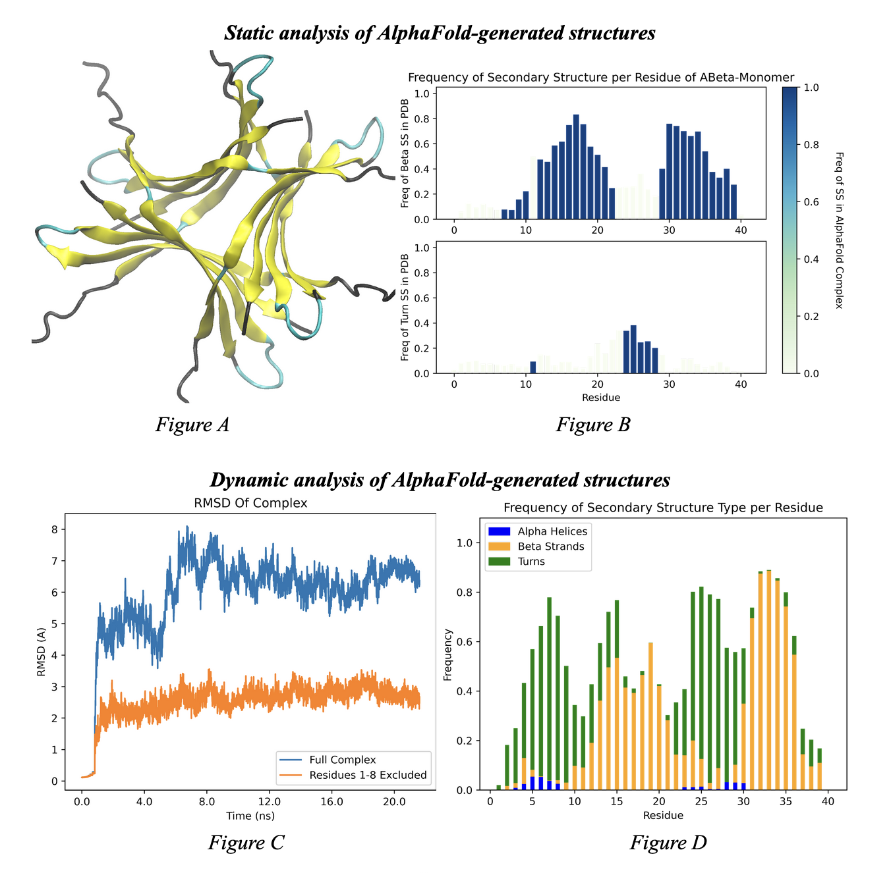

## Projects

---

## [How I (Techincally) Hacked the Department of Defense](/content/dod.md)

A quick writeup on the IDOR exploit I found on an AWS Bucket owned by the DOD.

---
## [Mackerel - A Chess Engline Written in Pure C](https://github.com/Turreted/Mackerel)

A chess engine with ~2,000 ELO. This is where I learned firsthand that there are horrible horrible bugs that can happen when you mix low-level C programming, recursion, and custom hashing methods.

---
## [Data Science / Bioinformatics Research](/pdf/quad.pdf)

---

### Other Projects
- *[Spotify Lyrics](https://github.com/Turreted/Spotify-Lyrics.git)* a popular API wrapper for Spotify that retrives the lyrics for whatever you're currently listening to. Integrates OAuth, credential caching, and some web scraping to retrive the lyrics. 
- *[Project Euler Solutions](https://github.com/Turreted/Project-Euler)* solutions I've written to select [Project Euler](https://projecteuler.net/) problems, which are difficult math/cs challenges. I'm currently working on [problem 360](https://projecteuler.net/problem=360)
---

---

Page template forked from <a href="https://github.com/evanca/quick-portfolio">evanca</a>

<!-- Remove above link if you don't want to attibute -->
